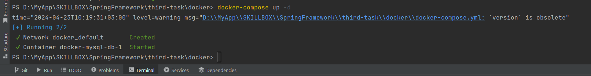
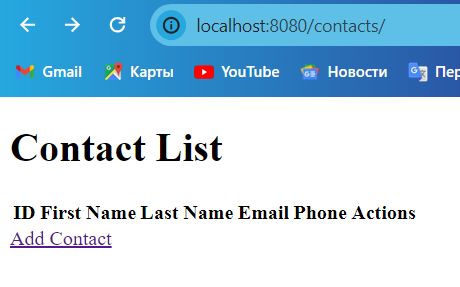
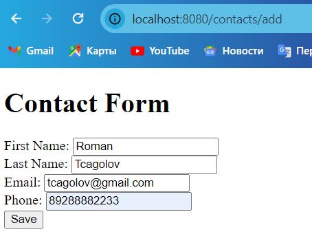
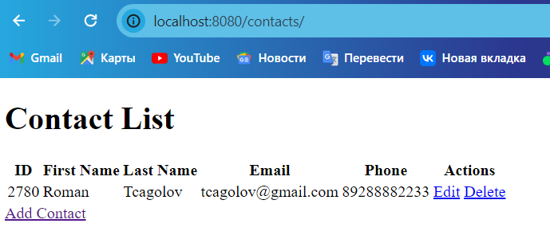
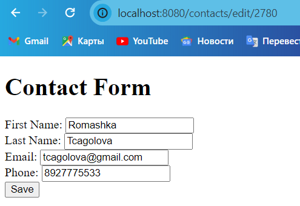
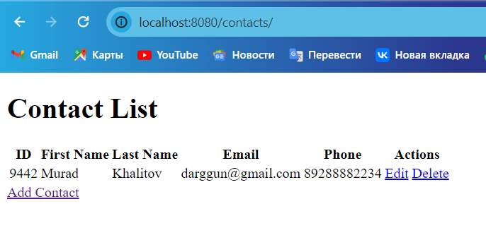

# ContactsManager

<h3>Создание и зупуск докер-образа</h3>
  
Для создания контейнера с БД MYSQL нужно перейти в папку "docker" командой "cd docker" и запустить "docker-compose" командой "docker-compose up -d".

  

 
Интерфейс приложения: 
<li>"http://localhost:8080/contacts/" - главная страница</li>
  

<li>Для добавлегия нового контакста переходим по ссылке "Add Contact"</li>
  

<li> Для сохранения нажимаем кнопку "Save"</li>
  

<li>"Edit" - изменить контакт</li>
  

<li>"Delete" - удалить контакт</li>
  

